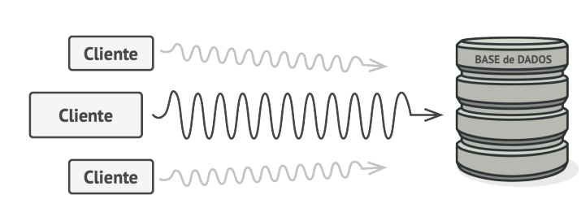
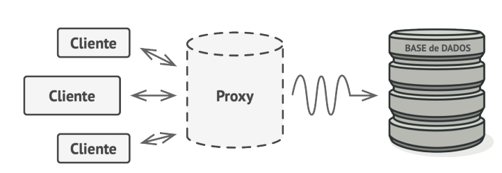
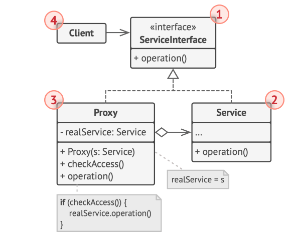

# Padrão de Projeto Proxy

O padrão de projeto Proxy é um padrão estrutural que fornece um substituto ou "placeholder" para outro objeto para controlar o acesso a ele. Este padrão é útil em várias situações, como controle de acesso, cache de resultados, entre outros. O Proxy age como um intermediário entre o cliente e o objeto real, permitindo que você adicione lógica adicional ao acessar o objeto.

## Benefícios do Padrão Proxy

- **Controle de Acesso:** Pode adicionar lógica para validar ou restringir o acesso ao objeto real.
- **Cache:** Armazena resultados de operações dispendiosas e reutiliza-os, economizando tempo e recursos.
- **Log ou Monitoramento:** Registra ou monitora as operações realizadas no objeto real sem modificar seu código.

## Estrutura do Padrão Proxy

Abaixo estão as três etapas principais para entender a estrutura e o benefício do padrão Proxy.

### 1. Sem o Uso de Proxy

Na primeira imagem, cada cliente faz diretamente uma chamada à base de dados, o que pode causar problemas de desempenho e sobrecarga no servidor/rede.



### 2. Com o Uso de Proxy

Na segunda imagem, o Proxy é introduzido como um intermediário. O Proxy pode cachear os resultados das consultas, reduzindo a carga na base de dados e melhorando o desempenho, o código aqui mostrado é um modelo, mas em casos de grande porte como consultar API pagas cacheando resultados por ser econômico ao não buscar na API resultados já consultados. 



### 3. Diagrama UML do Padrão Proxy

A última imagem mostra o diagrama UML do padrão Proxy, ilustrando as interações entre o Cliente, o Proxy e o Serviço Real.



## Como Funciona

1. **Client (Cliente):** A parte da aplicação que deseja acessar o serviço.
2. **Service (Serviço Real):** O objeto que contém a lógica real que o cliente quer acessar.
3. **Proxy:** O intermediário que controla o acesso ao Serviço Real, podendo adicionar funcionalidades como cache, log, ou controle de acesso.
4. **ServiceInterface (Interface de Serviço):** Uma interface comum para o Serviço e o Proxy, garantindo que ambos implementem os mesmos métodos.

## Exemplo de Implementação

Um exemplo típico de uso do padrão Proxy seria o cache de consultas a uma API, onde o Proxy armazena os resultados das chamadas à API e reutiliza-os quando o mesmo dado é solicitado novamente, evitando chamadas desnecessárias à rede.

```javascript
class ServiceInterface {
    async operation(cep) {
        throw new Error("erro do method");
    }
}

class ViaCepService extends ServiceInterface {
    async operation(cep) {
        const startTime = performance.now();
        const response = await fetch(`https://viacep.com.br/ws/${cep}/json/`);
        const data = await response.json();
        const endTime = performance.now();
        return { data, time: endTime - startTime, source: 'network' };
    }
}

class CacheProxy extends ServiceInterface {
    constructor(service) {
        super();
        this.realService = service;
        this.cache = {};
    }

    async operation(cep) {
        if (!this.cache[cep]) {
            const result = await this.realService.operation(cep);
            this.cache[cep] = result;
            return result;
        } else {
            const startTime = performance.now();
            const cachedResult = this.cache[cep];
            const endTime = performance.now();
            return { ...cachedResult, time: endTime - startTime, source: 'cache' };
        }
    }
}

const service = new ViaCepService();    
const proxy = new CacheProxy(service);  

// uso
async function fetchCepData(cep) {
    const result = await proxy.operation(cep);
    console.log(result);
}

fetchCepData('01001000');
fetchCepData('01001000');  // A segunda chamada usa o cache
